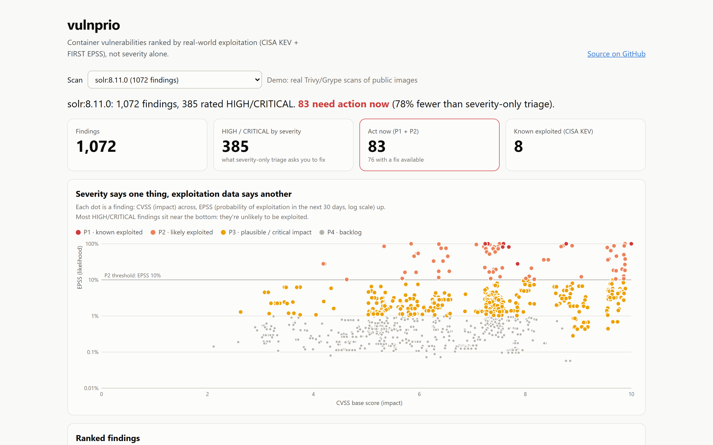
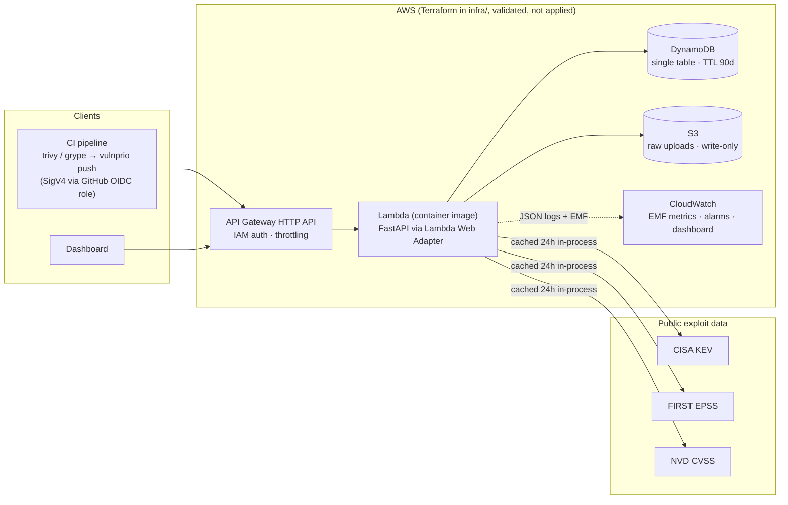

# vulnprio

[](https://github.com/reeve25/vulnprio/actions/workflows/ci.yml)
[](https://reeve25.github.io/vulnprio/)
[](LICENSE)

vulnprio ranks container-scanner findings by whether they are actually being exploited
([CISA KEV](https://www.cisa.gov/known-exploited-vulnerabilities-catalog) and
[FIRST EPSS](https://www.first.org/epss/)), not by severity alone.
Scanners report hundreds of HIGH/CRITICAL findings per image, but only a handful are likely to be exploited.
vulnprio tells you which handful to fix first and explains each ranking.

**▶ Live demo: https://reeve25.github.io/vulnprio/** shows real Trivy and Grype scans of public images, re-ranked against
today's exploit data. CI rebuilds it on every push and weekly.

[](https://reeve25.github.io/vulnprio/)

| Image (public, old tag) | Findings | HIGH/CRITICAL by severity | **Act now (P1+P2)** |
|---|---:|---:|---:|
| `solr:8.11.0` (ships Log4Shell) | 1,072 | 385 | **83** |
| `nginx:1.21` | 880 | 261 | **42** |
| `node:16-bullseye-slim` | 462 | 139 | **11** |
| `python:3.9-slim-bullseye` | 387 | 98 | **4** |

In total, triaging by severity queues 883 findings across these four images, and vulnprio flags 140 of them (84% fewer).
It also promotes things severity hides. For example, `CVE-2023-44487` (HTTP/2 Rapid Reset) is rated MEDIUM in the Jetty
packages, but it is in KEV with an EPSS score of 99.99%. *(Numbers from KEV catalog 2026.09.23; EPSS changes daily.)*

Python 3.12 · FastAPI · DynamoDB · S3 · Lambda · API Gateway · Terraform · LocalStack · GitHub Actions (OIDC).
**The AWS infrastructure is written in Terraform and checked in CI (validate, mocked `terraform test`, checkov). It
is deliberately never applied**, so this repo costs nothing to run ([why](DECISIONS.md#9-terraform-is-validated-never-applied)).

## Run it locally

```sh
git clone https://github.com/reeve25/vulnprio && cd vulnprio
docker compose up --build --wait      # API on :8080 + LocalStack (DynamoDB, S3)
curl --data-binary @samples/trivy_solr_8.11.0.json.gz "localhost:8080/scans?name=solr"
```

Then open <http://localhost:8080/ui/> to see the dashboard in live mode, where you can upload your own scans. The OpenAPI
schema is at <http://localhost:8080/openapi.json> (the Swagger UI is blocked by the strict CSP on purpose).

To use it as a CI gate without the server, run the CLI:

```sh
uv tool install git+https://github.com/reeve25/vulnprio
trivy image -f json -o scan.json myapp:latest
vulnprio gate scan.json               # exit 1 on fixable P1/P2 findings; waivers in .vulnprio-waivers
```

This repo gates its own container image the same way ([`ci.yml`](.github/workflows/ci.yml), job `image`).

## Architecture



A request flows **parse → enrich → score → store**, and each step is a small module:

| Module | Job |
|---|---|
| [`parsers.py`](src/vulnprio/parsers.py) | Detects Trivy JSON, Grype JSON, SARIF 2.1.0 or CSV from its structure and normalizes it into `Finding`s. Treats every input as hostile: size, nesting and finding-count caps, and any malformed shape returns a 400, never a 500. |
| [`enrich.py`](src/vulnprio/enrich.py) | Looks up KEV (the full catalog), EPSS (batched 100 CVEs per call) and NVD (a CVSS fallback capped at 5 lookups), all under one 15 s deadline. Each source fails independently and the scan records which data is missing. |
| [`scoring.py`](src/vulnprio/scoring.py) | Assigns tiers, ranks within each tier, and writes a human-readable `reasons[]` for every finding. |
| [`store.py`](src/vulnprio/store.py) | Stores to DynamoDB, with findings pre-sorted in the sort key (`F#{priority}#{rank}`) so a paginated `?priority=P1` read is a single `Query`. |
| [`api.py`](src/vulnprio/api.py) / [`cli.py`](src/vulnprio/cli.py) | Exposes the pipeline as a REST API and as `analyze` / `gate` / `push` commands. |

## Why this scoring model

| Tier | Rule | Meaning |
|---|---|---|
| **P1** | In CISA KEV | Exploitation has been observed in the wild. |
| **P2** | EPSS ≥ 10% | Likely to be exploited in the next 30 days. |
| **P3** | EPSS ≥ 1% or CVSS ≥ 9.0 | Plausible, or catastrophic if it happens. |
| **P4** | everything else | Backlog. |

Within a tier, findings are ordered with fixable ones first, then by EPSS, then by CVSS. The tiers are built this way for four reasons:

- **Severity is a weak proxy for risk.** Across 2016–2022, only 6.4% of published CVEs were ever seen exploited
  ([Jacobs et al., EPSS v3](https://arxiv.org/abs/2302.14172)). Meanwhile 39.4% of new CVEs in 2025 were rated
  HIGH/CRITICAL ([Gamblin](https://jerrygamblin.com/2026/01/01/2025-cve-data-review/)).
- **EPSS does the same job for about an eighth of the work.** Fixing everything with CVSS ≥ 7 catches 82.1% of exploited CVEs, but
  that means patching 58.1% of all CVEs (3.9% efficiency). An EPSS threshold of 0.088 catches 82.0% while patching only 7.3% (45.5%
  efficiency) (same paper, v3 model; FIRST now runs v5).
- **KEV is precise but narrow.** It had 53% efficiency but only 5.9% coverage in that study. FIRST's guidance is to
  [treat KEV entries as top priority regardless of EPSS](https://www.first.org/epss/using-epss), so KEV is P1 and
  EPSS widens coverage below it. CISA's [BOD 26-04](https://www.cisa.gov/news-events/directives/bod-26-04-prioritizing-security-updates-based-risk)
  also sets remediation deadlines that depend on KEV status.
- **The model uses tiers, not a blended score.** FIRST explicitly says not to multiply EPSS by CVSS to get one risk score. Tiers keep each
  signal's meaning intact, and every finding shows *why* it landed in its tier. CVSS ≥ 9.0 still reaches P3, so a
  catastrophic-impact bug is never buried just because nobody is exploiting it yet.

The thresholds are constants in `scoring.py`. The 10% cutoff sits above the paper's 0.088 point, which keeps P2 small enough to
act on this sprint, and P3 at 1% catches most of the remaining coverage. More detail and sources are in [`docs/RESEARCH.md`](docs/RESEARCH.md).

## Demo walkthrough

1. Open the [live demo](https://reeve25.github.io/vulnprio/). It starts on **solr:8.11.0**: 1,072 findings, 385 of them
   HIGH/CRITICAL, but **83 need action now**.
2. The scatter plot shows the problem. CVSS runs across and EPSS up (log scale). Most HIGH/CRITICAL dots sit below 1%
   EPSS, and the red and orange ones at the top are the ones attackers actually use.
3. In the table, the first row is **CVE-2021-44228 (Log4Shell)**: P1, in KEV, known ransomware use, EPSS 100%, fix `2.15.0`.
   The *Why* column lists every signal that put it there.
4. Click **P2**, then tick **Fix available only**. That is the rest of this sprint's work list.
5. Switch between **python:3.9 (Trivy)** and **python:3.9 (Grype)**. Two scanners report the same image slightly differently
   (Grype keys some matches by GHSA id, which vulnprio maps back to the CVE), and both land on the same 4 findings to act on.

## Engineering notes

- **Security.** The API uses IAM (SigV4) auth with no shared API keys, and CI deploys through a GitHub OIDC role whose `sub` is
  pinned to `main`. Each IAM grant is the minimum the code calls: the Lambda can only `PutObject` to `raw/*`, and
  `terraform test` asserts that. One KMS key covers all data at rest. The dashboard renders with `textContent` only, under a
  strict CSP. Actions are pinned to commit SHAs, and gitleaks scans the full history on every push.
- **Observability.** The app writes JSON logs with a request id and CloudWatch Embedded Metric Format metrics (no agent and no
  `PutMetricData` calls). SLOs, the error budget policy and the alarm→runbook mapping are in [`docs/SLO.md`](docs/SLO.md).
  "Enrichment completeness" is its own SLI, because a scan ranked without KEV data still returns 201 while looking safe.
- **Cost.** About $4.75/month idle at list price and about $7.50 at 1,000 scans/month ([`docs/COST.md`](docs/COST.md)). The
  Fargate + ALB and RDS + NAT alternatives it avoids cost roughly $45–50/month.
- **Tests.** There are 61 unit tests, with parsers run against real scanner output and hostile inputs, and enrichment tested against
  mocked feeds. Two integration tests run the real DynamoDB/S3 APIs in LocalStack, covering a round trip of 880 findings,
  pagination and a tampered cursor. The unit coverage gate is 85%.
- **Decisions.** 16 short ADRs in [`DECISIONS.md`](DECISIONS.md) cover choices such as FastAPI over Go, Lambda over Fargate,
  DynamoDB over RDS, and why the sort key embeds the tier.

## What I'd do next

1. **Reachability.** Tell apart a vulnerable package that is installed from one the app actually loads, for example with
   language call-graph analysis or runtime SBOM diffing. This is the next big cut after exploit data.
2. **Asset context.** Weight tiers by exposure (internet-facing or internal) and data sensitivity, the same inputs
   SSVC and BOD 26-04 use.
3. **Async ingest for big scans.** Move to a presigned S3 upload, then an S3 event, SQS and a worker, to get past the 4 MB and 30 s
   API Gateway limits.
4. **Trend view.** Track per-image burn-down of P1/P2 over time and time-to-remediate, which is the metric a vulnerability-management program reports.
5. **Actually deploy it** behind a budget alarm, and replace the static alarm thresholds with multi-window burn-rate alerts
   once there's real traffic to tune them against.

## License

[MIT](LICENSE). Sample scans in `samples/` are Trivy and Grype output for public Docker Hub images.
